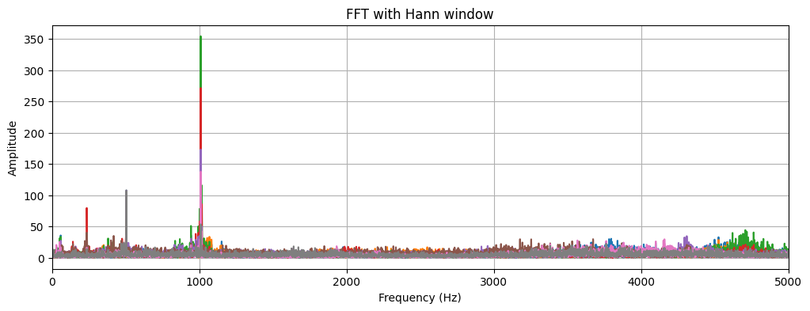
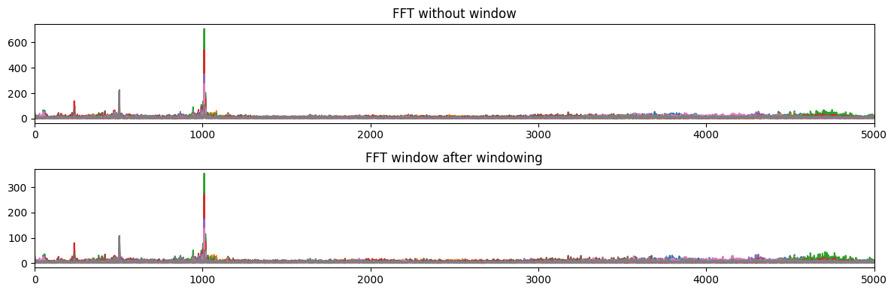
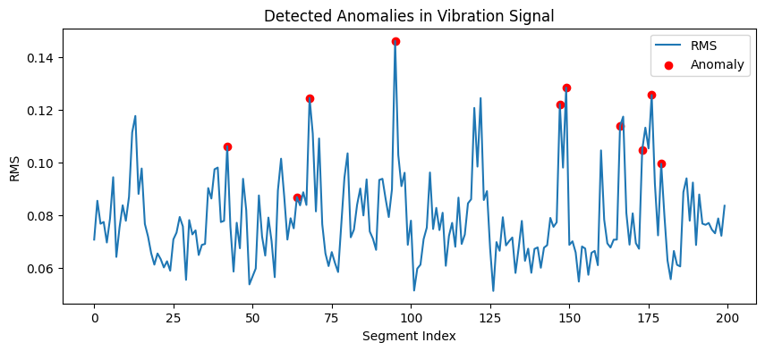
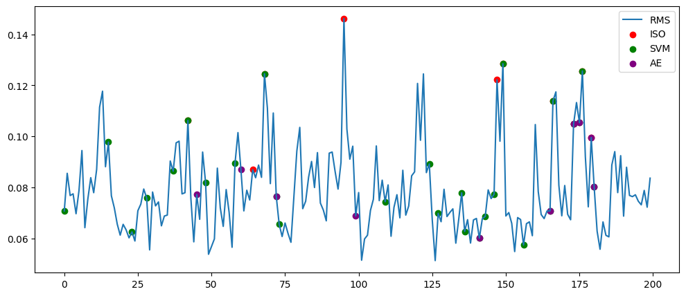
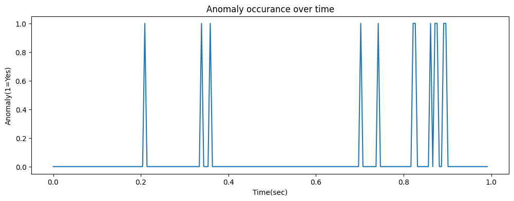
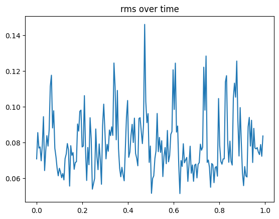
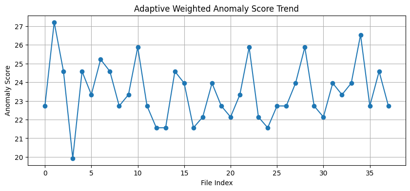
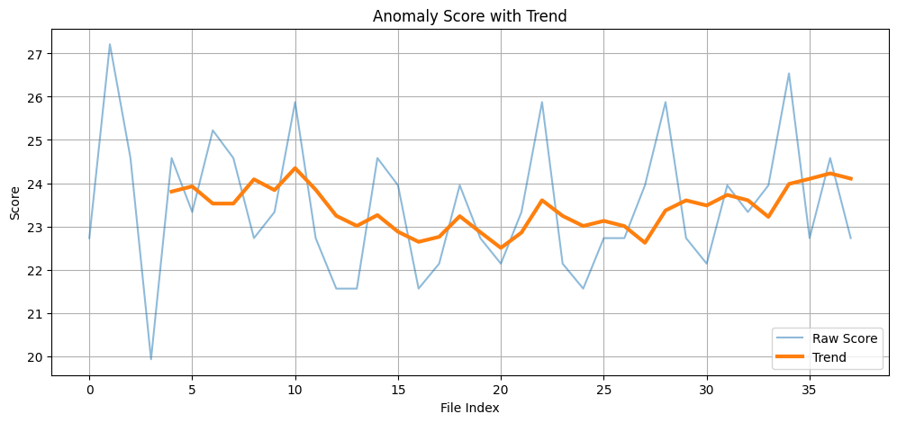
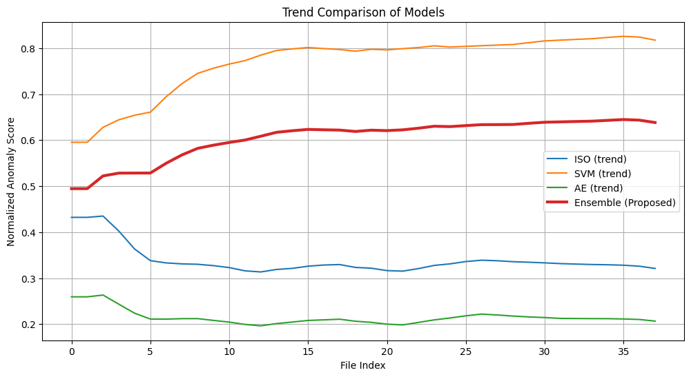
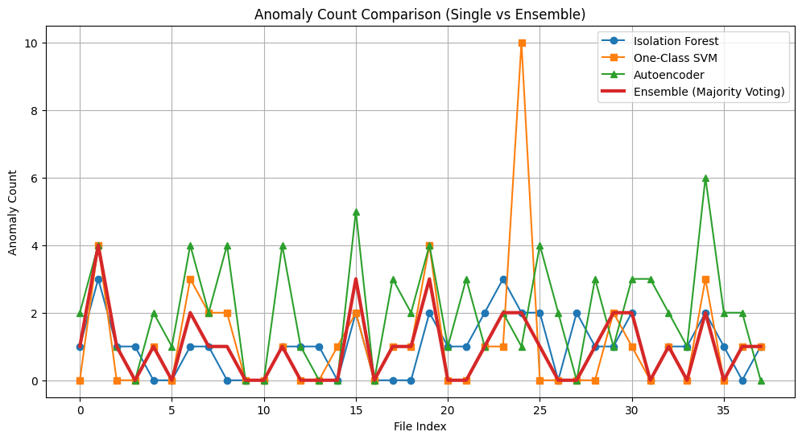

# ⚙️ Ensemble Anomaly Detection for Vibration-Based Predictive Maintenance

### 🚀 Multi-Channel Signal Fusion + Adaptive ML for Gas Turbine Health Monitoring

---

<table>
<tr>

<td align="center" width="25%">

### ⚙️ Domain
Predictive Maintenance  
Rotating Machinery

</td>

<td align="center" width="25%">

### 📡 Sensors
8-Channel Vibration  
Signal Monitoring

</td>

<td align="center" width="25%">

### 🤖 Models
IF · SVM · AE  
Ensemble Learning

</td>

<td align="center" width="25%">

### 🛰️ Application
Gas Turbine  
Health Monitoring

</td>

</tr>
</table>

## 🧠 Project Overview

This project presents an end-to-end vibration signal processing and anomaly detection framework for predictive maintenance of rotating machinery, particularly gas turbine systems.

The system transforms high-frequency vibration signals into structured feature representations and applies unsupervised learning to detect early-stage faults without requiring labeled data.

Unlike conventional approaches, this framework introduces:

- Multi-channel sensor fusion  

- Adaptive weighted ensemble anomaly detection  

- Continuous anomaly scoring for degradation monitoring  

---

<table>

<tr>

<td align="center" width="25%">

### ⚙️ Domain

Predictive Maintenance  

Rotating Machinery

</td>

<td align="center" width="25%">

### 📡 Sensors

8-Channel Vibration  

Signal Monitoring

</td>

<td align="center" width="25%">

### 🤖 Models

IF · SVM · AE  

Ensemble Learning

</td>

<td align="center" width="25%">

### 🛰️ Application

Gas Turbine  

Health Monitoring

</td>

</tr>

</table>

---

## 💡 Why This Project Matters

• Detects early-stage faults in rotating machinery  

• Works without labeled data (unsupervised learning)  

• Combines multiple ML models for reliability  

• Inspired by real aerospace diagnostic systems

• Introduces adaptive ensemble intelligence

## 🎯 Problem Statement

Gas turbine engines operate under extreme thermo-mechanical stresses. Early faults manifest as subtle changes in vibration patterns across multiple sensors.

Traditional methods:

• Use single-channel signals

• Rely on fixed thresholds

• Fail to capture early degradation

This project addresses:

• Multi-channel vibration signal processing

• Feature-level sensor fusion

• Unsupervised anomaly detection

• Degradation-aware monitoring

## 🏗️ System Architecture

1.	Raw Multi-Channel Signal Acquisition

2.	Window-Based Segmentation (1 sec @ 20480 Hz)

3.	Multi-Channel Feature Extraction

4.	Feature Fusion → High-Dimensional Feature Matrix

5.	Feature Scaling

6.	Multi-Model Anomaly Detection

7.	Adaptive Weighted Ensemble

8.	Degradation Trend Analysis

## ⚙️ Technical Pipeline

1️⃣ Signal Segmentation

• Sampling Rate: 20,480 Hz

• Window Size: 1 second

• Non-overlapping segmentation

2️⃣ Multi-Channel Feature Engineering

Features are extracted per channel and fused:

Time-Domain Features:-

• RMS

• Standard Deviation

• Kurtosis

• Crest, Shape, Impulse, Clearance Factors

Frequency-Domain Features:-

• Spectral Centroid

• Bandwidth

• Spectral Flatness

• Spectral Entropy

• Band Power

👉 This enables:

• Cross-sensor fault detection

• Improved system representation

• Higher sensitivity to subtle faults

### 3️⃣ Dataset Construction

### Each segmented window is converted into a feature vector:

	features = extract_features(segment, Fs)
	X.append(features)

### Final ML-ready dataset:

	X.shape = (n_samples, n_features)

### 4️⃣ Anomaly Detection Concept

Unsupervised anomaly detection is used due to lack of labelled fault data.

Conceptual methods explored:-

•	Z-score based deviation

•	Isolation Forest logic

•	Distance-based anomaly detection

•	Reconstruction-based (Autoencoder) principles

### 🤖 Multi-Model Anomaly Detection

Three complementary unsupervised models are used:

• Isolation Forest → detects statistical outliers

• One-Class SVM → detects boundary deviations

• Autoencoder → detects reconstruction anomalies

### 🧠 Proposed Novelty

🔥 1. Multi-Channel Feature Fusion

Instead of single-sensor analysis, this work integrates 8-channel vibration data, enabling richer fault representation and improved robustness.

🔥 2. Adaptive Weighted Ensemble (Core Contribution)

Unlike traditional majority voting:
	
	combined = (iso + svm + ae)

This work introduces:

 	Dynamic weighting based on model anomaly behavior

 Models contribute based on their confidence → more intelligent decision-making.

🔥 3. Continuous Anomaly Scoring

Instead of binary detection:, This project computes:

	Anomaly Score = intensity + frequency of anomalies

### Core assumption:

Healthy engine behavior forms a cluster in feature space. Deviations from this cluster indicate potential anomalies.

### 🧠 Ensemble Strategy

Instead of relying on a single model, a consensus-based approach is used:

	combined = (iso_labels == -1) + (svm_labels == -1) + (ae_labels == -1)

This improves:

• Detection reliability

• Robustness

• Reduction of false positives

### 📈 Degradation Trend Analysis

Anomaly scores are tracked across multiple time-series files:

	File Index → Anomaly Score → Trend

This enables:

• Detection of early-stage degradation

• Monitoring system stability

• Identifying onset of faults

### 📊 Key Contributions

• Multi-channel vibration signal fusion

• Adaptive weighted ensemble anomaly detection

• Continuous anomaly scoring mechanism

• Comparison of anomaly count vs anomaly score

• Degradation trend analysis for predictive maintenance

### 🛠️ Technologies Used

•	Python

•	NumPy

•	SciPy

•	Matplotlib

•	scikit-learn

•	Signal Processing (FFT, PSD, STFT)

•   TensorFlow (Autoencoder)

### 🧠 Key Insights

• Single-model detection is unreliable

• Multi-channel fusion significantly improves robustness

• Adaptive ensemble outperforms majority voting

• Anomaly score is more informative than count

• Early degradation appears as intermittent spikes

### 💡 Why This Project Matters

• Detects faults without labeled data (real-world scenario)

• Applicable to aerospace propulsion systems

• Bridges signal processing with machine learning

• Provides interpretable degradation indicators

### 🧠 Aerospace Relevance

Gas turbine propulsion systems require:

•	Continuous condition monitoring

•	Early fault prognostics

•	Predictive maintenance modeling

This project demonstrates how classical vibration diagnostics can be integrated with machine learning techniques to support intelligent health monitoring in aerospace propulsion systems.

### 📈 Future Improvements

• Spectral kurtosis & envelope analysis

• Deep learning (CNN/LSTM)

• Real-time streaming system

• Remaining Useful Life (RUL) prediction

• Web dashboard (Streamlit)

### Results and plots

.png)

.png)

.png)

.png)

.png)

.png)

.png)

.png)

## Model Performance

### Isolation Forest
- **Precision:** 0.375  
- **Recall:** 0.1579  
- **F1 Score:** 0.2222  
- **ROC-AUC:** 0.4765  

### One-Class SVM
- **Precision:** 0.4800  
- **Recall:** 0.6316  
- **F1 Score:** 0.5455  
- **ROC-AUC:** 0.5568  

### Autoencoder
- **Precision:** 0.4000  
- **Recall:** 0.1053  
- **F1 Score:** 0.1667  
- **ROC-AUC:** 0.4598  

### Ensemble (Proposed Method)
- **Precision:** 0.4286  
- **Recall:** 0.1579  
- **F1 Score:** 0.2308  
- **ROC-AUC:** 0.5651  

---

## Summary Table

| Model | Precision | Recall | F1 Score | ROC-AUC |
|--------|-----------|---------|-----------|----------|
| ISO | 0.375 | 0.158 | 0.222 | 0.476 |
| SVM | 0.480 | 0.632 | 0.545 | 0.557 |
| AE | 0.400 | 0.105 | 0.167 | 0.460 |
| ENS (Proposed) | 0.429 | 0.158 | 0.231 | **0.565** |

---

## Key Observation

The proposed **ENS (Ensemble)** model achieved the highest **ROC-AUC score (0.565)** among all evaluated methods, indicating improved threshold-independent anomaly discrimination capability for vibration-based anomaly detection.

### 📁 Repository Structure

  ├── README.md
  
  ├── requirements.txt
  
  ├── data/
  
  ├── .gitignore
  
  ├── results/
  
  ├── Notebook/	
  
  ├── Src/

  
  

### 📦 Installation:

	pip install -r requirements.txt

### IMP: Modify the data's file and folder path accordingly then use it.

### 🔐 License

This project is intended for academic and research purposes.

## 👨‍💻 Author

  

<table>
<tr>
<td align="center" width="500">

### 🧑‍🎓 Sahil Kumar  
**Robotics & Artificial Intelligence Student**  
Sir M. Visvesvaraya Institute of Technology  
Bengaluru, India  

</td>
</tr>
</table>

 

  
  
  

