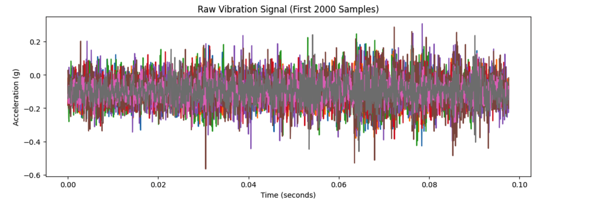
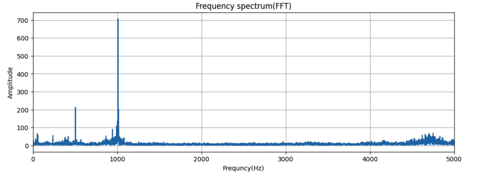
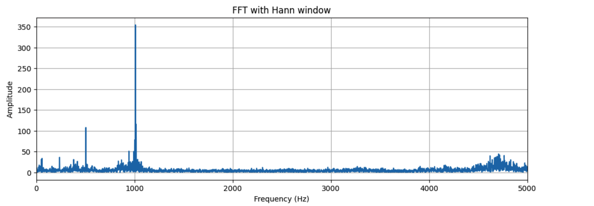
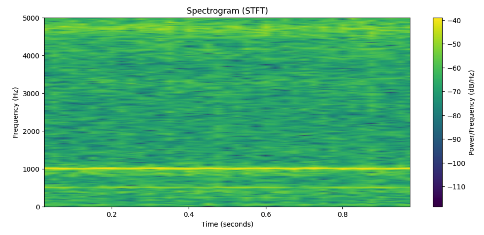

# Ensemble Anomaly Detection for Vibration-Based Predictive Maintenance

🚀 Multi-model ML + Signal Processing for Gas Turbine Health Monitoring

## 🔬 Project Overview

This project implements an end-to-end vibration signal processing and anomaly detection pipeline designed for gas turbine health monitoring applications. The objective is to transform high-frequency vibration signals into structured feature representations and apply unsupervised machine learning concepts for early anomaly detection.

The system architecture reflects methodologies used in aerospace propulsion diagnostics, where fault-labelled datasets are scarce and condition-based monitoring is critical. The pipeline is inspired by real-world engineering workflows applicable to gas turbine systems such as those developed at GTRE.

## 💡 Why This Project Matters

• Detects early-stage faults in rotating machinery  
• Works without labeled data (unsupervised learning)  
• Combines multiple ML models for reliability  
• Inspired by real aerospace diagnostic systems (GTRE/DRDO)

## 🎯 Problem Statement

Gas turbine engines operate under extreme thermo-mechanical stresses. Early-stage faults in compressors, turbines, bearings, or shafts often manifest as subtle changes in vibration signatures. Traditional threshold-based monitoring methods may not detect these deviations effectively.

This project addresses:

•	High-frequency vibration signal of multi channel receivers processing

•	Statistical and spectral feature engineering

•	ML-ready dataset construction

•	Unsupervised anomaly detection logic and training

## 🏗️ System Architecture

Step 1: Raw Vibration Signal Acquisition

Step 2: Window-Based Signal Segmentation (1 sec @ 20480 Hz)

Step 3: Time & Frequency Domain Feature Extraction

Step 4: Feature Vector Aggregation → Feature Matrix (X)

Step 5: Feature Matrix Construction

Step 6: Multi-Model Anomaly Detection

Step 7: Ensemble Decision

Step 8: Degradation Trend Analysis

## ⚙️ Technical Pipeline

### 1️⃣ Signal Segmentation

•	Sampling Rate: 20,480 Hz

•	Window Size: 1 second (20480 samples)

•	Non-overlapping segmentation	

	
	for start in range(0, len(sig2) - window_size + 1, window_size):
  	segment = sig2[start:start + window_size]
	segments.append(segment)

### 2️⃣ Feature Engineering

### Extracted features include:

### Time-Domain Features

•	Root Mean Square (RMS)
	
•	Standard Deviation

•	Kurtosis

•	Crest Factor

•	Shape Factor

•	Impulse Factor

•	Clearance Factor

### Frequency-Domain Features

•	Power Spectral Density (Welch Method)

•	Spectral Centroid

•	Spectral Bandwidth

•	Spectral Flatness

•	Spectral Entropy

•	Band Power (Selected Frequency Bands)

### These features capture:

•	Energy variations

•	Impulsive behavior

•	Frequency shifts

•	Structural degradation indicators

### 3️⃣ Dataset Construction

### Each segmented window is converted into a feature vector:

	features = extract_features(segment, Fs)
	X.append(features)

### Final ML-ready dataset:

	X.shape = (n_samples, n_features)

### 4️⃣ Anomaly Detection Concept

Unsupervised anomaly detection is used due to lack of labelled fault data.

Conceptual methods explored:-

•	Z-score based deviation

•	Isolation Forest logic

•	Distance-based anomaly detection

•	Reconstruction-based (Autoencoder) principles

### 🤖 Multi-Model Anomaly Detection

Three complementary unsupervised models are used:

• Isolation Forest → detects statistical outliers

• One-Class SVM → detects boundary deviations

• Autoencoder → detects reconstruction anomalies

### Core assumption:

Healthy engine behavior forms a cluster in feature space. Deviations from this cluster indicate potential anomalies.

### 🧠 Ensemble Strategy

Instead of relying on a single model, a consensus-based approach is used:

	combined = (iso_labels == -1) + (svm_labels == -1) + (ae_labels == -1)

A segment is considered anomalous if:

	≥ 2 models agree

This improves:

• Detection reliability

• Robustness

• Reduction of false positives

### 📈 Degradation Trend Analysis

Anomaly scores are tracked across multiple time-series files:

	File Index → Anomaly Score → Trend

This enables:

• Detection of early-stage degradation

• Monitoring system stability

• Identifying onset of faults

### 📊 Key Contributions

•	Designed structured signal segmentation pipeline

•	Implemented statistical and spectral feature extraction

•	Built ML-ready feature matrix from raw vibration signals

•	Applied engineering-aligned anomaly detection logic

•	Structured project for aerospace propulsion diagnostics context

### 🛠️ Technologies Used

•	Python

•	NumPy

•	SciPy

•	Matplotlib

•	scikit-learn

•	Signal Processing (FFT, PSD, STFT)

•   TensorFlow (Autoencoder)

### 🧠 Key Insights

• Single-model anomaly detection is unreliable

• Ensemble learning improves robustness and consistency

• Weighted anomaly scoring is more informative than simple counts

• Temporal trend analysis is essential for predictive maintenance

• Early-stage degradation appears as intermittent anomaly spikes

### 💡 Why This Project Matters

• Detects faults without labeled data (real-world scenario)

• Applicable to aerospace propulsion systems

• Bridges signal processing with machine learning

• Provides interpretable degradation indicators

### 🧠 Aerospace Relevance

Gas turbine propulsion systems require:

•	Continuous condition monitoring

•	Early fault prognostics

•	Predictive maintenance modeling

This project demonstrates how classical vibration diagnostics can be integrated with machine learning techniques to support intelligent health monitoring in aerospace propulsion systems.

### 📈 Future Improvements

• Multi-channel sensor fusion for improved robustness  

• Advanced features (spectral kurtosis, envelope, wavelets)  

• Deep learning models (LSTM, CNN) for temporal patterns  

• Real-time monitoring and alert system  

• Fault classification with labeled data  

• Remaining Useful Life (RUL) prediction  

• Model optimization and benchmarking  

• Simple dashboard for visualization (Streamlit/Flask)

### ⚡ Quick Demo

	from src.pipeline import run_pipeline
	
	results = run_pipeline("data/")
	print(results)

### Results and plots

### 📁 Repository Structure

  ├── README.md
  
  ├── requirements.txt
  
  ├── data/
  
  ├── .gitignore
  
  ├── results/
  
  ├── Notebook/
  
  

### 📦 Installation:

	pip install -r requirements.txt

### 🔐 License

This project is intended for academic and research purposes.

### 👨‍💻 Author

Sahil Kumar

B.E. Robotics and Artificial Intelligence

Sir M. Visvesvaraya Institute of Technology, Bengaluru

